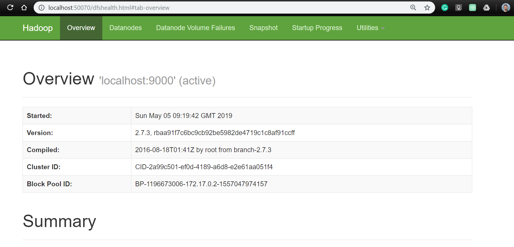
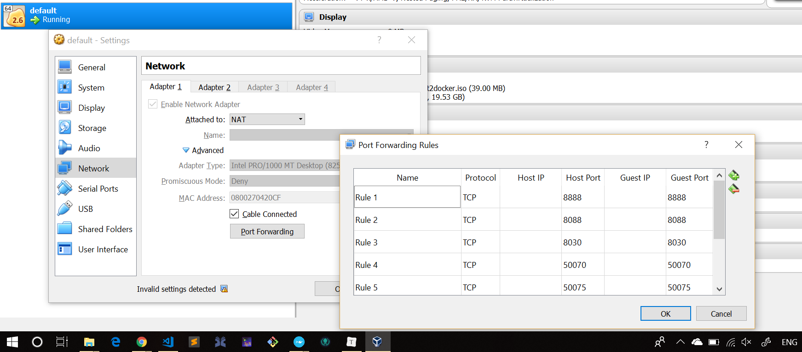
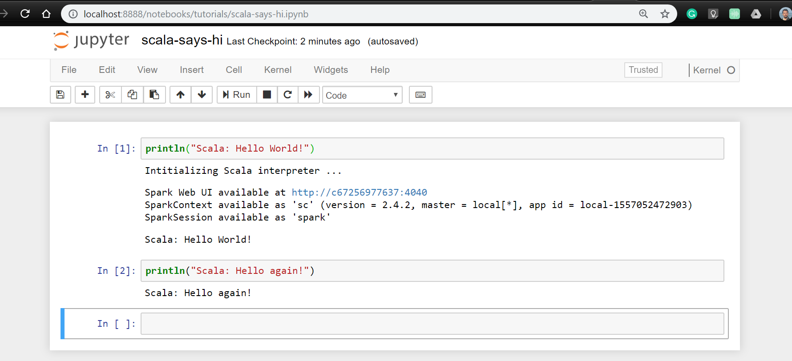

# Big Data Docker Guide
This guides you to create a Docker Image, and run it effectively. The docker includes Hadoop, Hbase, Spark, and Jupyter notebook with Python and Scala kernels.

The recipe checked against Mac OS and Windows 10 Home and Pro editions. Some minor details may differ based on your OS. 

For the rest of this guide, we assume you already clone or downloaded this repository on your local machine. You should also install and run Docker on your machine.

## Build

The first step is to build a Docker Image. It's like a virtual hard drive containing all software we need to practice Big Data exercises.

To create a Docker Image, we need a recipe. We already created a `dockerfile` for you containing all the steps we need to create our image. Do the followings:

* Open your terminal (e.g. iTerminal, PowerShell or Docker Quickstart Terminal) and go to the folder that you save the docker files. 

* Call `docker-machine status` to make sure docker service is running.

* Issue `docker build -t bd_img .` This reads looks into the current directory to find a `dockerfile`. If successful, reads and run all the commands in order. If everything goes well, you should have a new image called `bd_img` (you could use any other names).

* Run `docker images` to make sure you have the created image.

Congrats! You created your Big Data image. Please note that we do not need to recreate this image again unless we change `dockerfile`. Let's see how we can run it.

## Running Hadoop Daemons

The following does a few things at the same time:

* Runs our image (see above). A running image is called a Container. We can run an image as multiple containers if we like. In this example, we call our container `bd_cont`.

* `-v local/path:docker/path` maps your a folder on your local machine to a folder on the virtual machine (Docker Container). It's a very important feature which helps us to create and modify files using any software we like on our machine and see or run the files on our container. It also helps us to save the result of processes in the container as local files. Everything is synced; any change on local or docker container affects the other one. Please note that you can use any address you like to map (so change the command according to your need). Also, you can map multiple folders if you like (just use `-v` multiple times).

* `-p port_number:port_number` maps container ports to local ports. It helps us to see monitor the Hadoop and HBase activities in our browser. More importantly, it helps us to run Jupyter Server on our Docker Container, then connect to it using our browser.

* Finally it starts Hadoop services. We need Hadoop running for a variety of scenarios. The process may appear to freeze at the lines:

"Try 'chown --help' for more information. 
starting historyserver, logging to /opt/hadoop/logs/mapred--historyserver-d936d78dbdf7.out". 

This is fine. Leave this session as-is and open a new terminal session. Enter the following command to create and run a container:

```
docker run --rm  -v /c/Users/borhan/big_data_docker:/home -p 8088:8088 -p 8030:8030 -p 50070:50070 -p 50075:50075 -p 50030:50030 -p 50060:50060 -p 8888:8888 -p 9000:9000 -p 9999:9999 -p 4040:4040 --name bd_cont bd_img 
```

Ensure that you replace the path "/c/Users/borhan/big_data_docker" with an appropriate path on your local machine.

We need to run `docker exec -it bd_cont /bin/bash` later on to enter into an interactive shells (see below).
If everything goes well, you should be able to monitor the services using your browser: e.g. go to [http://localhost:50070](http://localhost:50070).

 


Notes: 

* Make sure your antivirus allows port forwarding. 

* Make sure no other software keep the above ports busy. In such case, change the mapping to other empty ports or close other software/services.

* Windows 10 Home users may need to manually map the ports. Open your Oracle VM VirtualBox Manager and find your Docker machine. It usually called **default**. Go to Settings >  Network > Adaptor 1 > Advanced > Port Forwarding. Now add all the above mappings. The final result would be something like:

 

## Interactive Environment

Run the following to enter to an interactive BASH environnement.
`docker exec -it bd_cont /bin/bash`

If everything goes right, you should be able to see something similar to the followings after running `ll /home`:

 


## Running Jupyter

* Go to interactive mode as discussed above.

* Run `./start-jupyter.sh` if you are in the right path (in this example `/home/`) or enter the following command:
`jupyter notebook --ip 0.0.0.0 --port=8888 --no-browser --allow-root --NotebookApp.token='' `
 This starts Jupyter Server and exposes it to port 8888.

* Open your browser and enter and go to
[http://localhost:8888](http://localhost:8888) .

* Create a Python/Scala Notebook using Python/spylon-kernel Kernel or open an existing notebook.

* Write, modify, run as many notebooks as you like. If you put them in the shared path (in this example `/home` folder or subfolder), you can access them via your machine (in this example `c:\Users\borhan\big_data_docker\`)

Note that the first command you run a in the Scala notebook may takes a few seconds to run (just to initiate the Spark sessions). See the following as an example:

 

## Running HBase

Do the followings:

* First make sure Hadoop services are running: `jps`

* Now, run an interactive shell (as discussed above), then do the following to start Hbase daemon (ignore the warnings if any):
`$HBASE_HOME/bin/start-hbase.sh`

* Make sure Hbase is running: `jps`

* Run Hbase shell: `hbase shell`

* Run HBase commands as you wish.

* To exit, run `quit`.

## SBT

SBT provides the ability to build Scala JAR files. Please see the [SBT Hello World tutorial](./tutorials/015_sbt_hello-world-template/) for details & instructions.

